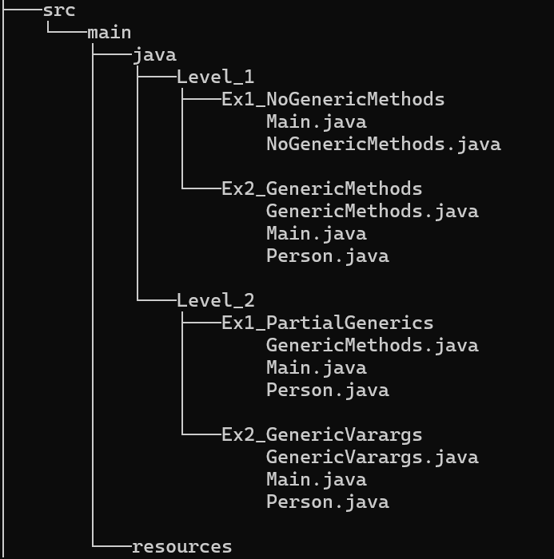

# Generics

El objetivo de este proyecto es aprender a utilizar tipos genéricos, métodos genéricos y `varargs`, combinando tipos genéricos con tipos específicos.

## Tecnologías

* Java 21
* IntelliJ IDEA
* GitHub

## Estructura del proyecto

## Instalación y Ejecución:
* Clonar el repositorio.
* Abrir en IntelliJ o Eclipse.
* Ejecutar Main.java.

## Nivel 1

### Ejercicio 1 - NoGenericMethods

Crea una clase con tres atributos del mismo tipo y permite acceder a ellos mediante métodos `get`.

### Ejercicio 2 - GenericMethods

Crea un método genérico que acepta tres argumentos de diferentes tipos y los muestra por consola.

## Nivel 2

### Ejercicio 1 - PartialGenerics

Modifica el ejercicio anterior para combinar los argumentos genéricos con un argumento de tipo fijo (`String`).

### Ejercicio 2 - GenericVarargs

Modifica el método anterior para aceptar un número variable de argumentos mediante `varargs` genéricos.
